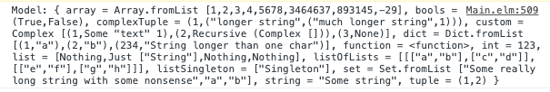
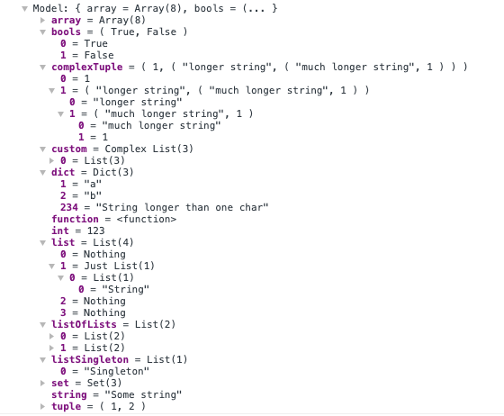

# elm-debug-transformer
Transform Elm Debug.log output into nice log object with custom formatter

The standard Elm `Debug.log` console output:


and the same output with this package 



## Installation

Just install this module with:

```yarn add -D elm-debug-transformer```

And in your `index.js` register it with:

```
import ElmDebugger from 'elm-debug-transformer';

ElmDebugger.register();
```

This would hook up your `console.log()` and try to parse each incoming message with Elm parser. If it fails, it would pass the original message.

### Enable custom formatters in Chrome dev tools
Available in Chrome 47 and higher.

The output object is kind of chatty right now (it carries information about parsed type etc. - less verbose version is worked on right now). 

If your browser have Chrome dev toools, you can enable custom formatters so you get less noice and nice output.

  - Open DevTools
  - Go to Settings ("three dots" icon in the upper right corner of DevTools > Menu > Settings F1 > Preferences > Console)
  - Check-in "Enable custom formatters"
  - Close DevTools
  - Open DevTools

Note: You might need to refresh the page first time you open Console panel with existing logs - custom formatters are applied only to newly printed console messages.


